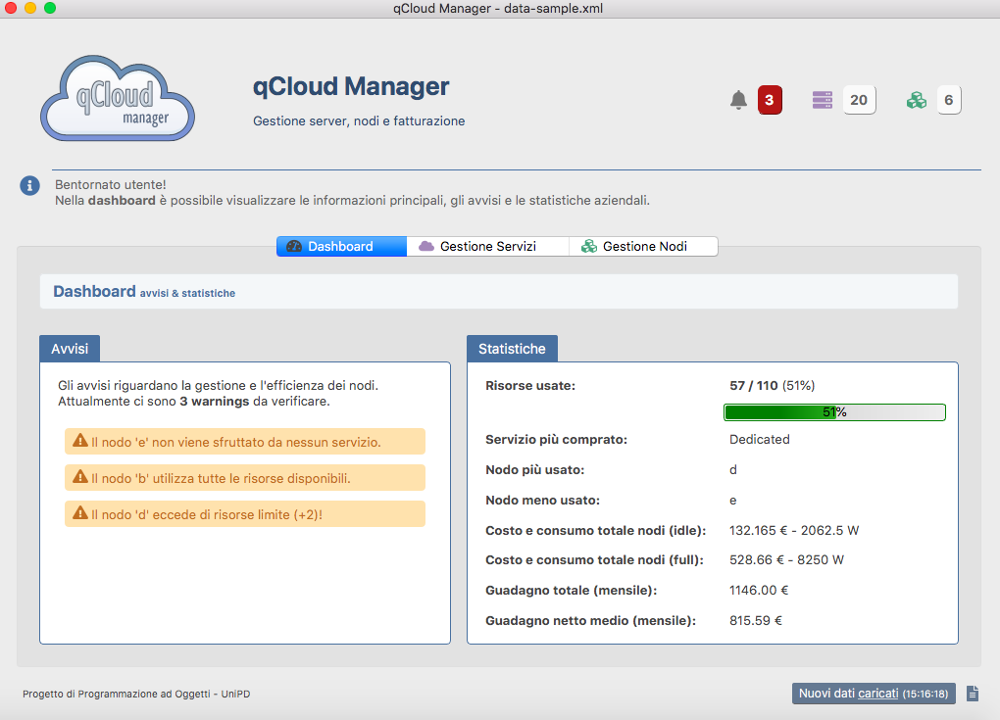
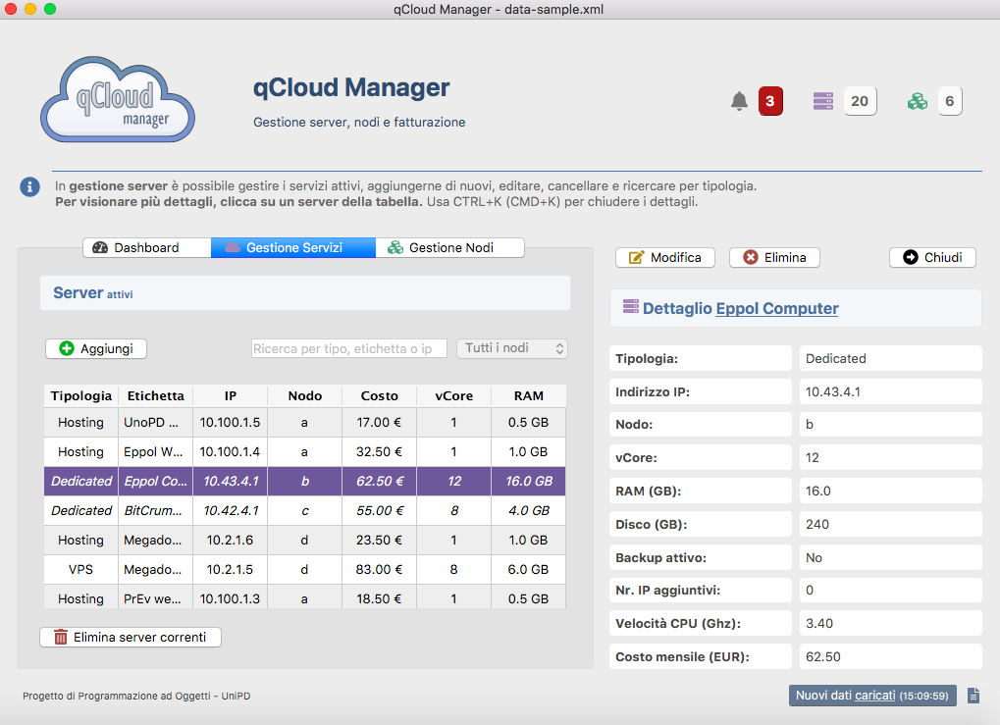
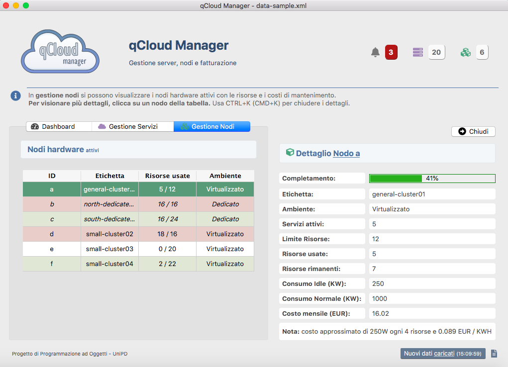
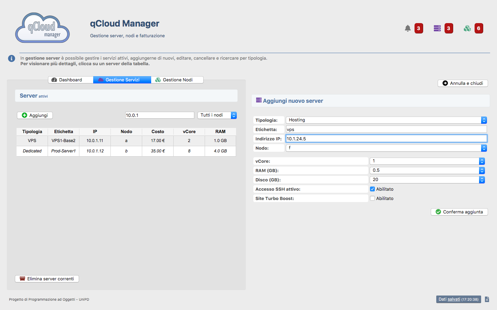
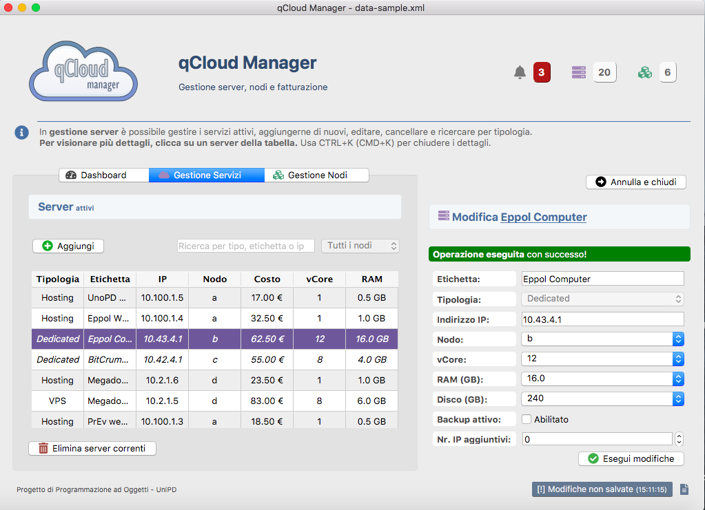

# qCloud Manager
## Progetto di programmazione a oggetti

*Corso di Laurea in Informatica, Scuola di Scienze, Dipartimento di
Matematica, UniPD*

---

---

### Relazione online

- [Introduzione al progetto](pages/intro.md)
- [Manuale del software](pages/manuale.md)
- [Progettazione del software](pages/progettazione.md)
- [Conclusioni](pages/conclusione.md)

---

- [Download relazione di progetto](download/relazione.pdf)

> Per [maggiori informazioni](https://maxelweb.github.com/qCloudUNIPD), si consiglia di proseguire alla repository.

### Galleria

### Licenza e disclaimer

Il software è pubblicato sotto licenza **GNU General Public License v3.0**. 
> Si consiglia caldamente di NON riutilizzare a fine universitario il codice, in parte o del tutto, visto che potrete andare incontro a sanzioni molto pesanti. Il progetto è stato messo pubblicamente per poter eventualmente trarre ispirazione e comprendere il meccanismo del MV di Qt, non per essere copiato. Procedete a vostro rischio e pericolo, ma qualsiasi richiesta di copiatura NON è a priori autorizzata, e qualora venisse scoperta verrà comunicata a chi di dovere.